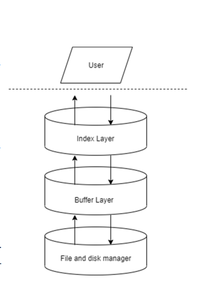
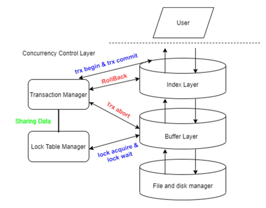
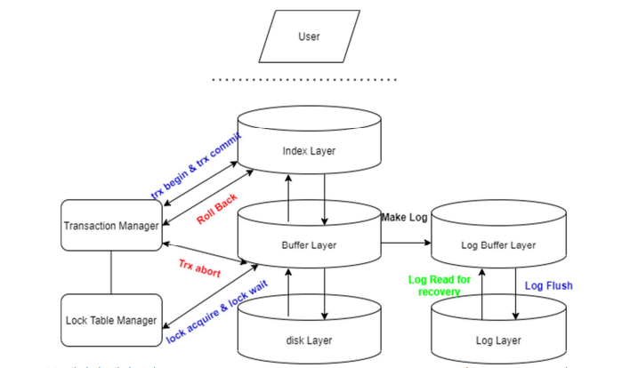

# Basic Implementation Of DBMS

    This project is implementation of DBMS

## 1. Overall Layered Architecture

    1) Index Layer: B+ Tree with delayed merge
    2) Buffer Layer: Linked List with LRU Policy
    3) File and disk manager: 4096kb fixed page file with clustered structure

## 2. Concurreny Control Implementation 

    Concurrency Implementation: strict-2PL & wait-for-graph

## 3. Crach Recovery(Just Logic no implementation)

