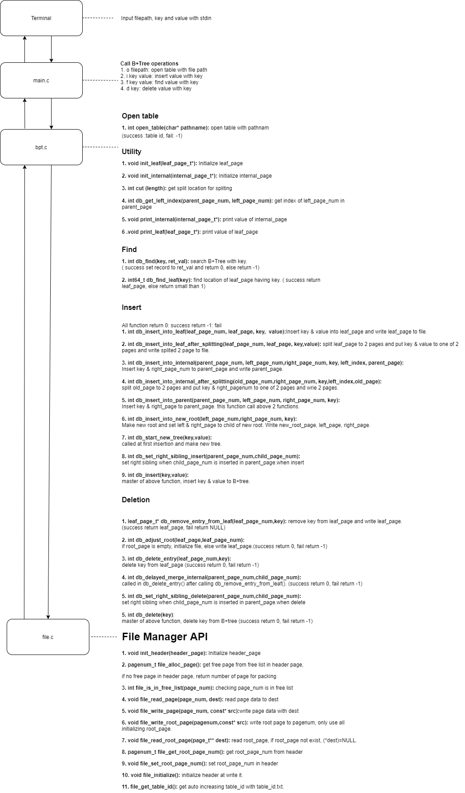

DISKED ON B+Tree
================

> ### This is implementation of disked on B+Tree using in memory B+Tree
 

Project Spec
================

1. On disk page size is 4096 Bytes. 
2. Record size is fixed with 128(8 for key, 120 for string value) Bytes.   
3. 4 types of pages (Header page, Free page, Leaf page, Internal page)    

1) Header page has header of free page, root page number, number of pages. It must be called first.  

2) Because free page is not user page, it only has next free page number for pointing.  

3) Leaf page has pairs of <key, value> and leaf page Header. Leaf page Header has parent page number(root=0), checking is Leaf,  
numbers of key, right sibling page number. What is important is that keys are sorted and maximum number of keys are 31.   

4) Internal Page has similar factors of leaf page. Followings are differences between them. In right sibling page number  
position, it has one more page number. Because it is like not leaf node in B+ Tree, it has one more pointing page. In pairs of <key, value> position, it has pairs of <key, page number>. What is important is that maximum numbers of keys are 248. 

Main Design
===============

Test
==============
**Enviroment: Ubuntu 20.04 LTS 64Bit, Intel Sky Lake**

**Case: insert 1~3999 and find 1~3999**   

**Case: insert 1~3999 and find 1~3999 and delete 1~3999**

Important Call Path
===============
> ### This shows call path of insertion and deletion
>   >### 1. Insertion Path

<pre>
<code>
insert (node* root, int key, int value)-> find(node* root, int key, bool verbose)->{
    1) case: no node in tree -> start_new_tree(int key, record* pointer)-> done!      
    2) case: tree is exist -> find_leaf(node* root, int key, bool verbose)->{
        1) case: leaf has empty space -> insert_into_leaf(node* leaf, int key, record* pointer)-> done!
        2) case: leaf has not empty space -> insert_into_leaf_after_splitting(node* root, node* leaf, int key, record * pointer)
    }
}
</code>
</pre>  
This is call path in insert function. First, checking duplicating for satisfies fundamental condition using find function.Second, we divide 2 cases of tree by node exist.  
In case 1, create new node and set root is end of insertion. In case 2, we need to find leaf to inserting <key,value>.  
After finding leaf, we divide 2 cases of tree by empty space of leaf. In case 1, we don't need split and merge. Therefore, we can use insert_into_leaf function to end of insertion.  
In case 2, we need to split and merge. Therefore we need to use insert_into_leaf_after_splitting function.

        
<pre>
<code>
while(!done) {   
    Insert_into_parent(node* root ,node* left int key, node *right)->{ 
        1) case: Tree doesn’t have root -> insert_into_new_root(node* left, int key, node* right)-> done!  
        2) case: Tree has root -> get_left_index(node* parent, node* left) -> { 
            1) case: parent has empty space -> insert_into_node(node* root, node* n, int left_index, int key, node* right ) -> done!  
            2) case: parent doesn’t have empty space -> insert_into_node_after_spliting(node* root, node * parent, int left_index, int key, node* right) 
        }   
    }   
}  
</code>
</pre>
This is call path in insert_into_leaf_after_spliting function. After spliting, we insert records to parent using Insert_into_parent function. After that we need to divide case
by exist of root. In case 1, we make root node and set this as parent of existing nodes with insert_into_new_root function. We doesn't need any spliting and merging, So it is done.    
In case 2, we need to get insertion index of splited node to parent using get_left_index function. After that we need to divide 2 case like leaf case in call path in insert function.  
such that 'parent has empty space' and 'parent doesn't have empty space'. In case 1, we doesn't need any spliting and merging, So it is done by insert_into_node function. In case 2, we need to split parent of splitted node 
by insert_into_node_after_spliting function. Until parent doesn't need any spliting or merging, we do this sequence recursively.    

>   >### 2. Deletion Path
<pre>
<code>
Delete(node* root, int key)->find(node* root, int key, bool verbose) and find_leaf(node* root, int key, bool verbose)->    
delete_entry(node * root, node* n, int key, void* pointer)->remove_entry_from_node(node* n, int key, node* pointer)->{    
	Case 1: deleted node is root node->adjust_root (root){    
		Case 1: root isn’t empty -> return root-> done!   
		Case 2: root is empty -> {   
				Case 1: root is leaf -> no more record -> return NULL->done!   
				Case 2: root isn’t leaf -> make new root-> return new root->done!    
                }   
        }   
        Case 2: deleted node isn’t root node -> {   
	       Case 1: remaining number of keys is larger than or equal to minimum requirement number of keys. ->   
               return root->done!   
	       Case 2: remaining number of keys is smaller than minimum requirement number of keys. ->    
               get_neighbor_index(node*n)->{   
		      Case 1: neighbor and current node can fill minimum requirement of number of keys from lending    
                      <key,record> -> redistribute_nodes(node * root, node * n, node* neighbor, int neighbor_index, int    
                       k_prime_index, int k_prime)  
		      Case 2: neighbor and current node cannot fill minimum requirement of number of keys from lending    
                      <key,record> -> coalesce_nodes(node* root, node *n, node * neighbor, int neighbor_index, int k_prime)   
               }  
        }  
}  
</pre>
</code>

This is delete function call-path.   
First, finding record and leaf using find function and find_leaf function. And go to  
delete_entry function with key,leaf. Then using remove_entry_from_node function to remove record. At that time, we need to  
divide 2 case with deleted record location.   
In case 1, record is in root node. Then we use adjust_root function to set root.  
In this case, we need to think emptiness of root. If root isn't empty, just return root. If root is empty, we must look at   
leaf of root. If root has leaf, make new root with leaf and return it. If root doesn't have leaf, it means that all nodes are  
empty. So, return Null.   
Let's look case 2 such that deleted node isn't root node. In this case, we need to divide case with  
minimum requirement numbers of keys. 
Minimum requirement numbers of keys differs by node location. If node is     
leaf, it is** ⌈order-1⌉/2**. else, it is **⌈order/2⌉-1**. 
In case 1, emaining number of keys is larger than or equal to minimum    
requirement number of keys. In this case, just return root. 
In case 2, remaining number of keys is smaller than minimum    
requirement number of keys. So we need to solve this with neighbor node, using get_neighbor_index function to get left   neighbor index of node. **If node is already most left, we will see right neightbor.** . 
The solution differs by case. In  
case 1, neighbor and current node can fill minimum requirement of number of keys from lending <key,record>. use  
redistribute_nodes function. otherwise, we need to merge. So use coalesce_nodes function. I will describe more detail in next content.  

Coalesce_nodes
=============

Coalesece_nodes function first check location of neighbor node. If neighbor node is right node, swap.
After this preprocessing, we need to think two cases such that 'node is leaf node' or ''node isn't leaf node'
#### 1. Node is leaf node.
If it is leaf node, we merge left and right node. Following pictures are examples of flow.
**1. Capacity is 4, but sum of keys is 3.**

**2. Move right node to left node**

**3. Remove right node from parent and adjust root.**

#### 2. Node isn't leaf node.
If isn’t leaf node, we cannot satisfy condition of numbers of key. So, we need to get data from parent.
**1. Capacity is 3, sum of numbers of keys is 2.**

**2. Get parent data and put end of neighbor.**

**3. Copy records to neighbot.**

**4.  Remove right node form parent and adjust root.**

★ *This process get data from parent. Therefore, parent node’s condition of number of keys can be broken. It that case, we need to this coalesce_nodes function or following redistribute_nodes function.*

redistribute_nodes
=============

Redistribute_nodes function checks location of neighbor node.
##### Location Of Neighbor.
This function's operations are similar in different location of neighbor node. Like 'left rotation' to 'right rotation',
'left most record' to 'right most record'. So I just write that location of neighbor is left.

### location of neighbor is left.
Like above, we need to divide 2 case such that ‘node is leaf node’ and ‘node isn’t leaf node’
## 1. Node is leaf node.
**1. Capacity 4, sum of number of keys is 5**

**2. Right shift node’s records **

**3. Move neighbor’s right most key & pointer to left most location in node**

**4. Set parent for satisfying tree condition.**

## 2. Node isn't lef node.
**1.Capacity is 3, sum of number of keys is 4**

**2. Right shift node's records.**

**3. Move neighbors’ right most pointer to left most location in node**

**4. Right rotate keys(left -> center -> right).**

                        