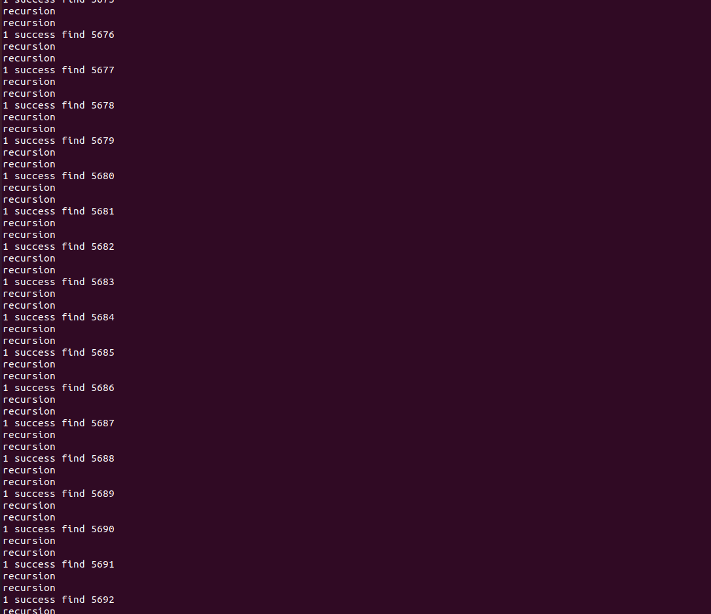

Disked on B+tree with Buffer
===================
> ##### This is disked on B+tree with buffer that has double linked list LRU policy.

Design Introduction
===================
> ##### This is showing my design implementation   
>   > ##### 1. Control of buffer  
             I controll my buffer with buffer_header that has head & tail for double linked list LRU policy, total buffer size, 
         current using buffer size. My buffer controll methods with above buffer_header are followings.      
         1. If target page exists in buffer, move to head of double linked list.  
         2. If target page not exists in buffer, check buffer is full. If buffer is full, making free space with LRU policy.   
         After that load target page from disk and attach to head of double linked list.     
>   > ##### 2. Direction of Design
             This design is for "working buffer with smallest buffer size". Some design seperatelly controll header and root   
         page, but my design doesn't care about those pages. In my test, this design can work with only 2 buffers for each table.
>   > ##### 3. Minimum modification
              Except buffer.c, other files are similar to project2. 

Main Design
===============

Test
===============
**Enviroment: Unbuntu LTS 20.04, Intel Sky lake**  
**1. Randomized 7000 inputs with buffer and find with disked on B+tree.**
1) Insert 7000 inputs

2) find 7000 inputs with disk

**2. Randomized 7000 inputs with buffer and find. After that delete 4000 inputs and reinsert 3000 inputs and all delete.**
1) Randomized 7000 inputs with buffer and find and delete 4000 inputs

2) reinsert 3000 inputs and find and all delete.

