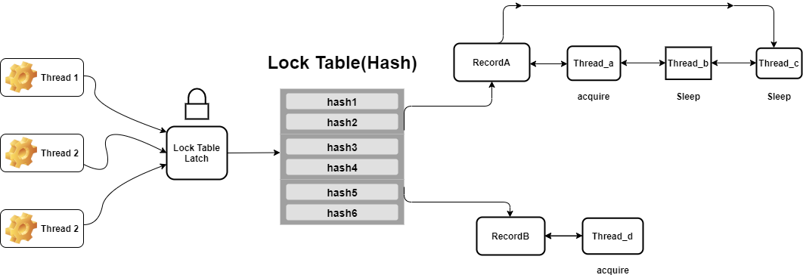
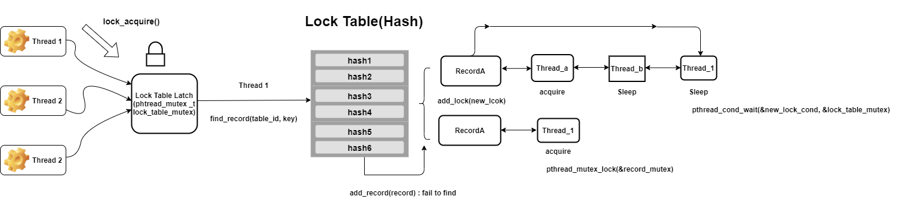
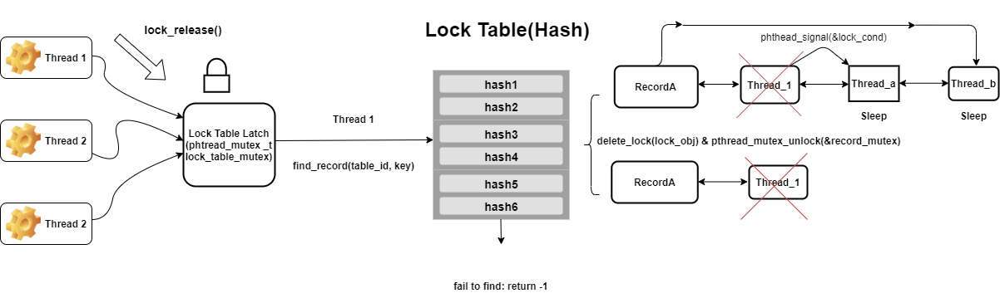

Lock Table
==========
> ##### This is lock table with hash table that has record_id & table_id

What is lock Table?
==================
> In multithread accessing to target record, wrong reading & writing to the record can be done because of sharing.   
> So locking thread is need to avoid above problem. In conclusion, lock table is table that has locking thread function.  

Design Overview
=================

Hash Table
===============
> My lock table uses ["uthash"](https://troydhanson.github.io/uthash/) for implementing hash.

Lock Table Access API
================
> 1. init_lock_table(): 
initiate lock table. Because my design doesn't need any initialization, just return 0  

> 2. lock_t* lock_acquire(int table_id, int64_t key):   
making thread acquire lock. If no thread exists in record that has table_id & key, then acquire lock, else put current thread to sleep.  
return lock with current thread.  

> 3. int lock_release(lock_t* lock_obj):   
release lock_obj from record. After release lock, make wake up thread that has 2nd proirity. At last free lock_obj.   
**In my design only release thread that has acquire lock. **   
If success return 0, else return -1;    

